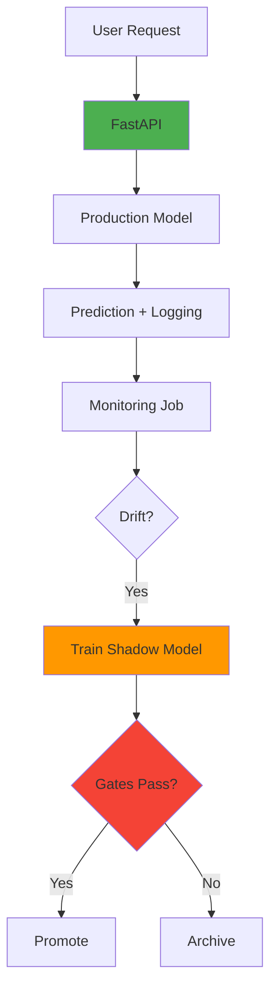

# 🔄 Self-Healing MLOps Pipeline

<div align="center">


**Production-grade ML pipeline with automated drift detection and intelligent retraining**

[Architecture](#-architecture) • [Quick Start](#-quick-start) • [Documentation](#-documentation) • [Testing](#-testing)

</div>

---

## 📋 Table of Contents

- [Overview](#-overview)
- [Features](#-features)
- [Architecture](#-architecture)
- [Quick Start](#-quick-start)
- [Project Structure](#-project-structure)
- [Phase-by-Phase Guide](#-phase-by-phase-guide)
- [Testing](#-testing)
- [CI/CD](#-cicd-pipeline)
- [Configuration](#-configuration)
- [Monitoring](#-monitoring)
- [Troubleshooting](#-troubleshooting)
- [Contributing](#-contributing)

---

## 🎯 Overview

A **production-grade ML system** that monitors model performance, detects drift, and automatically retrains when needed. Built with real-world MLOps best practices, not toy examples.

### What Makes This Different?

| Feature | Typical Student Project | This Project |
|---------|------------------------|--------------|
| **Model Deployment** | Train once, deploy, done | Continuous monitoring + retraining |
| **Drift Detection** | Not implemented | Statistical drift detection (Evidently AI) |
| **Decision Logic** | Manual intervention | Automated evaluation gates |
| **Production Readiness** | Local scripts | Docker, CI/CD, tests, documentation |
| **Data Reality** | Instant labels | Handles delayed ground truth |

---

## ✨ Features

### Core Capabilities

- 🎯 **Credit Risk Prediction** - Real-time prediction API
- 📊 **Drift Detection** - Statistical monitoring with Evidently AI
- 🔄 **Automated Retraining** - Shadow models with evaluation gates
- 🐳 **Fully Containerized** - Docker Compose orchestration
- 📈 **MLflow Integration** - Experiment tracking + model registry
- 🧪 **Comprehensive Testing** - Unit, integration, and validation tests
- 🚀 **CI/CD Pipeline** - GitHub Actions automation
- 📚 **Production Documentation** - Architecture diagrams + runbooks

### Technical Highlights

**Phase 1-2: Foundation**
- FastAPI prediction service
- MLflow experiment tracking
- Docker containerization
- Dataset fingerprinting

**Phase 3: Monitoring**
- Proxy metrics (no labels needed)
- Drift detection (Evidently AI)
- Time-windowed analysis
- Frozen reference data

**Phase 4: Self-Healing**
- Shadow model training
- Multi-criteria evaluation gates
- Automated model promotion
- Rollback mechanisms

**Phase 5: Orchestration**
- Airflow DAG workflows
- Scheduled retraining
- Pipeline automation

**Phase 6: Production Polish**
- 100+ unit/integration tests
- Data validation (Pandera)
- CI/CD with GitHub Actions
- Code quality enforcement

---

## 🏗️ Architecture

### High-Level Overview



**[📖 Detailed Architecture Documentation](docs/architecture.md)**

### System Components

```
┌─────────────────────────────────────────────┐
│          Self-Healing ML System             │
├─────────────────────────────────────────────┤
│                                             │
│  API Layer          → FastAPI service       │
│  Model Layer        → Production + Shadow   │
│  Monitoring Layer   → Drift detection       │
│  Retraining Layer   → Automated updates     │
│  Storage Layer      → MLflow + CSV          │
│  Orchestration      → Airflow DAGs          │
│                                             │
└─────────────────────────────────────────────┘
```

---

## 🚀 Quick Start

### Prerequisites

```bash
# Required
docker --version        # 20.10+
docker-compose --version # 2.0+
python --version        # 3.10+

# Optional (for development)
git --version
docker --version
```

### Quick Start (5 Minutes)

```powershell
# Clone and enter project
git clone <repo-url>
cd self-healing-mlops

# Create virtual environment
python -m venv venv
.\venv\Scripts\Activate.ps1  # Windows PowerShell

# Install dependencies
pip install -r requirements.txt
pip install -r requirements-dev.txt

# Start services
docker-compose up -d

# Run tests
pytest tests/ -v

# View MLflow
start http://localhost:5000
```

**👉 See [QUICK_START_NO_MAKEFILE.md](QUICK_START_NO_MAKEFILE.md) for detailed commands (no Makefile needed)**

### Next Steps

```powershell
# Create reference data
python scripts/bootstrap_reference.py

# Train model
python src/train_model_mlflow.py

# Test prediction
curl -X POST http://localhost:8000/predict \
  -H "Content-Type: application/json" \
  -d '{"age": 25, "income": 50000, "credit_score": 750, "employment_years": 3}'
```

### Expected Output

```json
{
  "prediction": 0,
  "probability": 0.087,
  "model_version": "1",
  "prediction_id": "pred_20240115_143022",
  "timestamp": "2024-01-15T14:30:22"
}
```

---

## 📂 Project Structure

```
self-healing-mlops/
│
├── 📄 README.md                          # This file
├── 🐳 docker-compose.yml                 # Multi-service orchestration
├── 📋 Dockerfile                         # Container definition
├── ⚙️ pyproject.toml                     # Python config
├── 🔧 Makefile                           # Automation commands
│
├── 🌐 src/                               # Source code
│   ├── api_mlflow.py                    # FastAPI service
│   ├── train_model_mlflow.py            # Model training
│   │
│   ├── 💾 storage/
│   │   ├── prediction_logger.py         # Append-only logging
│   │   └── label_store.py               # Ground truth storage
│   │
│   ├── 📊 analytics/
│   │   ├── proxy_metrics.py             # Label-free metrics
│   │   ├── drift_detection.py           # Evidently wrapper
│   │   └── model_evaluator.py           # True performance
│   │
│   ├── 🔍 monitoring/
│   │   └── monitoring_job.py            # Batch processor
│   │
│   ├── 🔄 retraining/
│   │   ├── shadow_trainer.py            # Train candidates
│   │   ├── evaluation_gate.py           # Decision logic
│   │   └── model_promoter.py            # Safe deployment
│   │
│   ├── ⏰ orchestration/
│   │   ├── scheduler.py                 # Simple scheduler
│   │   └── retraining_orchestrator.py   # Airflow DAG
│   │
│   └── 🛠️ utils/
│       └── dataset_fingerprint.py       # Data versioning
│
├── 🧪 tests/                             # Test suite
│   ├── conftest.py                      # Pytest fixtures
│   ├── unit/                            # Unit tests
│   ├── integration/                     # Integration tests
│   └── fixtures/                        # Test data
│
├── 📁 data/                              # Training data
│   └── cs-training.csv
│
├── 📦 models/                            # Local model storage
│
├── 📊 monitoring/                        # Monitoring outputs
│   ├── reference/                       # Frozen baseline
│   ├── predictions/                     # Logged predictions
│   ├── labels/                          # Ground truth
│   ├── metrics/                         # Analysis results
│   └── reports/                         # Drift reports
│
├── 🔄 airflow/                           # Airflow setup
│   ├── dags/
│   └── config/
│
├── 📚 docs/                              # Documentation
│   ├── architecture.md                  # System design
│   ├── api.md                           # API reference
│   └── runbook.md                       # Operations guide
│
└── 🔧 .github/                           # CI/CD
    └── workflows/
        └── ci-cd.yml                    # GitHub Actions
```

---

## 📖 Phase-by-Phase Guide

### Phase 1: Foundation (Week 1-2)
**Goal:** Basic prediction service

```bash
# Train model
python src/train_model_mlflow.py

# Start API
python src/api_mlflow.py

# Test
curl http://localhost:8000/predict -d @sample.json
```

**✅ Deliverable:** Working FastAPI service with trained model

---

### Phase 2: Docker + MLflow (Week 3-4)
**Goal:** Reproducible infrastructure

```bash
# Bootstrap
docker-compose up -d mlflow
docker-compose up trainer

# Verify
open http://localhost:5000
```

**✅ Deliverable:** Containerized training + MLflow tracking

---

### Phase 3: Monitoring (Week 5-6)
**Goal:** Drift detection

```bash
# Bootstrap reference
docker-compose run --rm bootstrap

# Start monitoring
docker-compose up -d monitoring

# Check results
ls monitoring/metrics/monitoring_results/
```

**✅ Deliverable:** Automated drift detection running

---

### Phase 4: Retraining (Week 7-8)
**Goal:** Automated model updates

```bash
# Trigger retraining
docker-compose exec airflow airflow dags trigger retraining_pipeline

# Monitor
docker-compose logs -f airflow
```

**✅ Deliverable:** Self-healing pipeline with evaluation gates

---

### Phase 5: Orchestration (Week 9-10)
**Goal:** Full automation

**✅ Deliverable:** End-to-end automated workflow

---

### Phase 6: Production Polish (Week 11-12)
**Goal:** Portfolio-ready project

```bash
# Run tests
pytest tests/ -v

# Check code quality
black src/ tests/
flake8 src/ tests/
mypy src/

# Verify CI/CD
git push  # Triggers GitHub Actions
```

**✅ Deliverable:** Production-grade codebase

---

## 🧪 Testing

### Run All Tests

```bash
# All tests with coverage
pytest tests/ -v --cov=src --cov-report=html

# Unit tests only
pytest tests/unit/ -v

# Integration tests only
pytest tests/integration/ -v

# Specific test
pytest tests/unit/test_evaluation_gate.py::TestEvaluationGate::test_gate_passes_on_good_shadow_model -v
```

### Test Coverage

```bash
# Generate coverage report
pytest --cov=src --cov-report=html

# View report
open htmlcov/index.html
```

### Pre-commit Hooks

```bash
# Install hooks
pre-commit install

# Run manually
pre-commit run --all-files
```

---

## 🔄 CI/CD Pipeline

### GitHub Actions Workflow

```yaml
Trigger: Push to main/develop
  ↓
├─ Data Validation (Pandera schemas)
├─ Code Quality (Black, Flake8, MyPy)
├─ Unit Tests (pytest)
├─ Integration Tests
├─ Model Training & Validation
├─ Docker Build
└─ Deploy (on main only)
```

### CI Status Badges


---

## ⚙️ Configuration

### Environment Variables

```bash
# MLflow
MLFLOW_TRACKING_URI=http://mlflow:5000

# Monitoring
MONITORING_INTERVAL=300        # 5 minutes
MONITORING_LOOKBACK=24         # 24 hours

# Retraining
MIN_F1_IMPROVEMENT_PCT=2.0     # Require 2% improvement
MAX_BRIER_DEGRADATION=0.01     # Calibration tolerance
MIN_SAMPLES_FOR_DECISION=200   # Statistical validity
```

### Configuration Files

- **pyproject.toml** - Black, pytest, mypy, coverage config
- **.flake8** - Flake8 linting rules
- **mypy.ini** - MyPy type checking config
- **.editorconfig** - Editor consistency
- **.pre-commit-config.yaml** - Git pre-commit hooks

---

## 📊 Monitoring

### Dashboards

- **MLflow UI:** http://localhost:5000
- **API Docs:** http://localhost:8000/docs
- **Airflow UI:** http://localhost:8080

### Key Metrics

```bash
# Prediction stats
curl http://localhost:8000/monitoring/stats | jq

# Latest monitoring results
cat monitoring/metrics/monitoring_results/monitoring_*.json | jq

# Drift reports
open monitoring/reports/drift_reports/drift_report_*.html
```

### Alerts & Notifications

*Note: Alert configuration is environment-specific (PagerDuty, Slack, etc.)*

---

## 🔧 Troubleshooting

### Common Issues

<details>
<summary><b>Services won't start</b></summary>

```bash
# Check Docker
docker-compose ps

# View logs
docker-compose logs mlflow
docker-compose logs api

# Restart clean
docker-compose down -v
docker-compose up -d
```
</details>

<details>
<summary><b>"Insufficient samples" error</b></summary>

```bash
# Check prediction count
curl http://localhost:8000/monitoring/stats

# Generate test predictions
bash scripts/generate_test_predictions.sh 250
```
</details>

<details>
<summary><b>Tests failing</b></summary>

```bash
# Install dev dependencies
pip install -r requirements-dev.txt

# Run with verbose output
pytest tests/ -v -s

# Check specific failure
pytest tests/unit/test_drift_detection.py -v
```
</details>

### Debug Mode

```bash
# Enable debug logging
export LOG_LEVEL=DEBUG

# Run service with debug
docker-compose up api  # no -d flag
```

---

## 📚 Documentation

- [📖 Architecture Overview](docs/architecture.md)
- [🌐 API Reference](docs/api.md)
- [📋 Operations Runbook](docs/runbook.md)
- [🔍 Decision Gate Criteria](docs/evaluation_gates.md)
- [🐛 Troubleshooting Guide](docs/troubleshooting.md)

---

## 🤝 Contributing

```bash
# Fork repository
git clone https://github.com/yourusername/self-healing-mlops.git

# Create branch
git checkout -b feature/amazing-feature

# Make changes and test
pytest tests/ -v

# Ensure code quality
black src/ tests/
flake8 src/ tests/

# Commit
git commit -m "Add amazing feature"

# Push
git push origin feature/amazing-feature

# Open Pull Request
```

---

## 📄 License

This project is licensed under the MIT License - see [LICENSE](LICENSE) file.

---

## 🙏 Acknowledgments

- **Dataset:** "Give Me Some Credit" from Kaggle
- **MLflow:** Experiment tracking and model registry
- **Evidently AI:** Drift detection framework
- **FastAPI:** Modern Python API framework

---

## 📊 Project Stats


---

<div align="center">

**Built with discipline** • **Deployed with confidence** • **Monitored with precision**

⭐ Star this repo if you find it useful!

[Report Bug](https://github.com/yourusername/self-healing-mlops/issues) • [Request Feature](https://github.com/yourusername/self-healing-mlops/issues)

</div>
