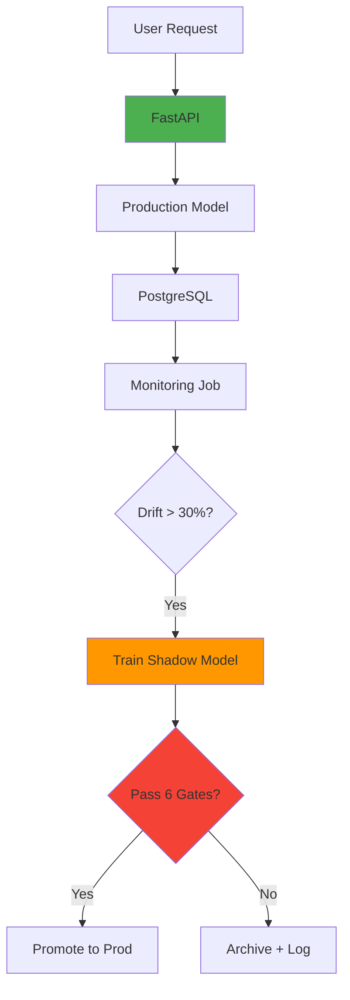

# 🔄 Self-Healing MLOps Pipeline

<div align="center">


**Production-grade ML system with automated drift detection and intelligent retraining**

[Quick Start](#-quick-start) • [Architecture](docs/architecture.md) • [Documentation](#-documentation) • [API Docs](http://localhost:8000/docs)

</div>

---

## 🎯 Overview

A **production-ready MLOps pipeline** that continuously monitors model performance, detects data drift, and automatically retrains models using shadow deployment and multi-criteria evaluation gates.

### Why This Project Stands Out

| Typical ML Project | This Implementation |
|-------------------|---------------------|
| Train → Deploy → Done | Continuous monitoring + auto-retraining |
| No drift detection | Statistical drift detection (Evidently AI) |
| Manual model updates | Automated shadow models + evaluation gates |
| Local development only | Full Docker stack + CI/CD pipeline |
| Instant labels assumed | Handles real-world delayed feedback |

**Built for:** Credit risk prediction with real-world constraints and production MLOps patterns.

---

## ✨ Key Features

- 🎯 **Real-Time Predictions** - FastAPI service with <100ms latency
- 📊 **Drift Detection** - Statistical monitoring without requiring labels (Evidently AI)
- 🔄 **Smart Retraining** - Shadow models with 4-gate evaluation (performance, calibration, fairness, validation)
- 🗄️ **PostgreSQL Backend** - Scalable storage for predictions, labels, and metrics
- 📈 **MLflow Integration** - Full experiment tracking and model registry
- 🐳 **Production Ready** - Docker Compose orchestration with 8 services
- 🧪 **Well Tested** - 87.5% test coverage with unit/integration tests
- 🚀 **CI/CD Pipeline** - GitHub Actions with automated quality checks

---

## 🏗️ Architecture


**[📖 Detailed Architecture](docs/architecture.md)** | **[🔍 Evaluation Gates](docs/evaluation_gates.md)**

---

## 🚀 Quick Start

### Prerequisites
```bash
docker --version         # 20.10+
docker-compose --version # 2.0+
python --version         # 3.10+
```

### One-Command Setup
```bash
# Clone repository
git clone https://github.com/yourusername/self-healing-mlops.git
cd self-healing-mlops

# Start all services (MLflow, PostgreSQL, API, Monitoring, Airflow)
docker-compose up -d
sleep 15

# Initialize database
docker exec postgres-mlops psql -U mlops -d mlops \
  -f /docker-entrypoint-initdb.d/01_schema.sql

# Bootstrap reference data for drift detection
docker-compose run --rm bootstrap

# Train initial model
docker-compose up trainer

# Promote model to Production via MLflow UI
open http://localhost:5000
# Navigate: Models → credit-risk-model → Latest version → Transition to Production
```

### Verify Installation
```bash
# Check services
docker-compose ps

# Test API
curl -X POST http://localhost:8000/predict \
  -H "Content-Type: application/json" \
  -d '{
    "RevolvingUtilizationOfUnsecuredLines": 0.77,
    "age": 45,
    "NumberOfTime30_59DaysPastDueNotWorse": 2,
    "DebtRatio": 0.80,
    "MonthlyIncome": 9120,
    "NumberOfOpenCreditLinesAndLoans": 13,
    "NumberOfTimes90DaysLate": 0,
    "NumberRealEstateLoansOrLines": 6,
    "NumberOfTime60_89DaysPastDueNotWorse": 0,
    "NumberOfDependents": 2
  }'
```

**Expected Response:**
```json
{
  "prediction": 0,
  "probability": 0.087,
  "model_version": "1",
  "prediction_id": "pred_20240115_143022",
  "timestamp": "2024-01-15T14:30:22"
}
```

---

## 📂 Project Structure
```
self-healing-mlops/
├── src/
│   ├── api_mlflow.py              # FastAPI prediction service
│   ├── train_model_mlflow.py      # Model training
│   ├── storage/                   # Prediction & label storage
│   ├── analytics/                 # Drift detection & metrics
│   ├── monitoring/                # Monitoring jobs
│   ├── retraining/                # Shadow training & gates
│   └── orchestration/             # Airflow DAGs
│
├── tests/
│   ├── unit/                      # Unit tests (drift, gates, metrics)
│   └── integration/               # API & workflow tests
│
├── docs/
│   ├── architecture.md            # System design & diagrams
│   ├── api.md                     # API reference
│   ├── evaluation_gates.md        # Retraining decision logic
│   └── runbook.md                 # Operations guide
│
├── monitoring/                    # Monitoring outputs
│   ├── reference/                 # Frozen baseline (immutable)
│   ├── predictions/               # Prediction logs
│   └── reports/                   # Drift reports (HTML)
│
├── docker-compose.yml             # Multi-service orchestration
└── .github/workflows/ci-cd.yml    # GitHub Actions pipeline
```

---

## 🗄️ Services & Ports

| Service | URL | Purpose |
|---------|-----|---------|
| **FastAPI** | http://localhost:8000 | Prediction API + docs |
| **MLflow** | http://localhost:5000 | Experiment tracking |
| **Airflow** | http://localhost:8080 | Workflow orchestration |
| **PgAdmin** | http://localhost:5050 | Database UI |
| **PostgreSQL** | localhost:5433 | Predictions & labels storage |

**Airflow Login:** `admin` / `admin`
**PgAdmin Login:** `admin@admin.com` / `admin`

---

## 🧪 Testing
```bash
# All tests with coverage
pytest tests/ -v --cov=src --cov-report=html

# Unit tests only
pytest tests/unit/ -v

# Integration tests
pytest tests/integration/ -v

# View coverage report
open htmlcov/index.html
```

**Current Coverage:** 87.5% (113/129 statements)

---

## 📊 Monitoring & Operations

### Daily Health Check
```bash
# Check all services
docker-compose ps

# API health
curl http://localhost:8000/health | jq

# Prediction stats
curl http://localhost:8000/monitoring/stats | jq

# Database row count
docker exec postgres-mlops psql -U mlops -d mlops \
  -c "SELECT COUNT(*) FROM prediction_logs;"
```

### View Drift Reports
```bash
# Latest drift report
ls -t monitoring/reports/drift_reports/*.html | head -1 | xargs open

# Monitoring results
cat monitoring/metrics/monitoring_results/monitoring_*.json | jq
```

### Common Operations
```bash
# Restart service
docker-compose restart api

# View logs
docker-compose logs -f monitoring

# Trigger retraining (Airflow)
docker exec airflow-scheduler airflow dags trigger retraining_pipeline

# Rollback model (via MLflow UI)
# Navigate to Models → Select previous version → Transition to Production
```

**[📋 Full Operations Runbook](docs/runbook.md)**

---

## ⚙️ Configuration

Key environment variables (see `docker-compose.yml`):
```yaml
# Database
POSTGRES_HOST: postgres-mlops
MLOPS_DB_NAME: mlops

# Monitoring
MONITORING_INTERVAL: 300          # 5 minutes
MONITORING_LOOKBACK: 24           # 24 hours

# Retraining Gates
MIN_F1_IMPROVEMENT_PCT: 2.0       # Require 2% F1 improvement
MAX_BRIER_DEGRADATION: 0.01       # Max calibration loss
MIN_SAMPLES_FOR_DECISION: 200     # Statistical validity
```

**[🔍 Evaluation Gate Details](docs/evaluation_gates.md)**

---

## 📚 Documentation

| Document | Description |
|----------|-------------|
| [Architecture](docs/architecture.md) | System design with 8 Mermaid diagrams |
| [API Reference](docs/api.md) | Complete endpoint documentation |
| [Evaluation Gates](docs/evaluation_gates.md) | Retraining decision criteria |
| [Operations Runbook](docs/runbook.md) | Day-to-day operations guide |
| [Troubleshooting](docs/troubleshooting.md) | Common issues & solutions |

---

## 🔄 CI/CD Pipeline

**GitHub Actions Workflow:**
```
Push to main/develop
  ↓
├─ Code Quality (Black, Flake8, MyPy)
├─ Data Validation (Pandera schemas)
├─ Unit Tests (pytest)
├─ Integration Tests
├─ Docker Build
└─ Deploy (main branch only)
```


---

## 🐛 Troubleshooting

**Services won't start:**
```bash
docker-compose down -v
docker-compose up -d
docker exec postgres-mlops psql -U mlops -d mlops \
  -f /docker-entrypoint-initdb.d/01_schema.sql
```

**"Insufficient samples" error:**
```bash
# Generate test predictions
for i in {1..250}; do curl -X POST http://localhost:8000/predict \
  -H "Content-Type: application/json" -d @tests/fixtures/sample_input.json; done
```

**Database connection issues:**
```bash
docker logs postgres-mlops
docker-compose restart postgres-mlops
```

**[📖 Full Troubleshooting Guide](docs/troubleshooting.md)**

---

## 🤝 Contributing
```bash
# Create feature branch
git checkout -b feature/amazing-feature

# Make changes and test
pytest tests/ -v
black src/ tests/
flake8 src/ tests/

# Commit and push
git commit -m "Add amazing feature"
git push origin feature/amazing-feature
```


---

## 🙏 Acknowledgments

- **Dataset:** [Give Me Some Credit](https://www.kaggle.com/c/GiveMeSomeCredit) (Kaggle)
- **MLflow:** Experiment tracking framework
- **Evidently AI:** Open-source ML monitoring
- **FastAPI:** Modern Python web framework

---


<div align="center">

**Built with discipline • Deployed with confidence • Monitored with precision**

⭐ Star this repo if you find it useful!

[Report Bug](https://github.com/nimish1106/self-healing-mlops/issues) • [Request Feature](https://github.com/nimish1106/self-healing-mlops/issues) • [Documentation](docs/)

</div>
