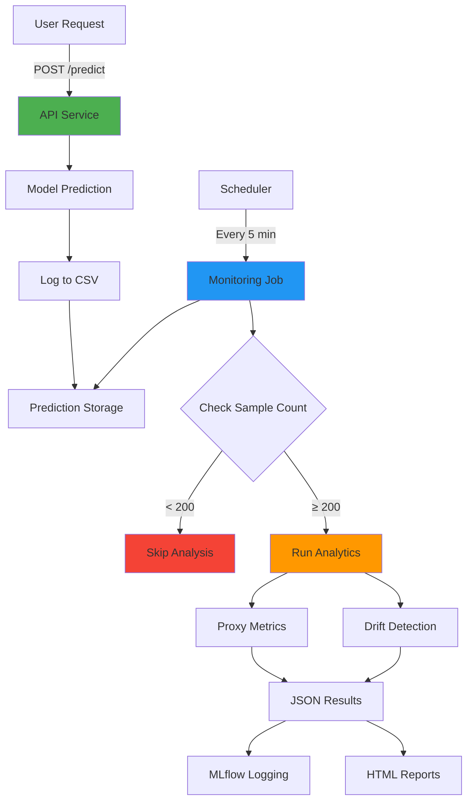

# 🔍 Phase 3: Monitoring & Drift Detection

<div align="center">


**Passive monitoring layer with statistical drift detection**

[Quick Start](#-quick-start) • [Architecture](#-architecture) • [Configuration](#-configuration) • [Troubleshooting](#-troubleshooting)

</div>

---

## 📋 Table of Contents

- [What's New](#-whats-new-in-phase-3)
- [Architecture](#-architecture)
- [Quick Start](#-quick-start)
- [Key Concepts](#-key-concepts)
- [Configuration](#-configuration)
- [Verification](#-verification)
- [Troubleshooting](#-troubleshooting)

---

## ✨ What's New in Phase 3

<table>
<tr>
<td width="50%">

### 🎯 Core Components

| Component | Purpose |
|-----------|---------|
| 📦 **Frozen Reference** | Immutable baseline for comparison |
| 📝 **Prediction Logger** | Append-only storage |
| 📊 **Proxy Metrics** | Label-free trend analysis |
| 🔬 **Drift Detection** | Statistical tests via Evidently |
| ⚙️ **Monitoring Job** | Batch analytics processor |
| ⏰ **Scheduler** | Simple orchestration |

</td>
<td width="50%">

### 🚫 What Phase 3 Does NOT Do

- ❌ Trigger retraining
- ❌ Update models
- ❌ Send alerts
- ❌ Compute accuracy
- ❌ Make decisions

<br/>

> **Phase 3 = Observation**  
> **Phase 4 = Action**

</td>
</tr>
</table>

---

## 🏗️ Architecture



### 🔄 Data Flow

```
┌─────────────┐
│ User Request│
└──────┬──────┘
       ↓
┌─────────────────────────────────────┐
│  API: Prediction + Logging          │
└──────┬──────────────────────────────┘
       ↓
┌─────────────────────────────────────┐
│  predictions.csv (append-only)      │
└──────┬──────────────────────────────┘
       ↓
   [5 minutes]
       ↓
┌─────────────────────────────────────┐
│  Monitoring Job Wake Up             │
└──────┬──────────────────────────────┘
       ↓
┌─────────────────────────────────────┐
│  Sample Check (≥200?)               │
└──────┬──────────────────────────────┘
       ↓
┌──────────────┬──────────────────────┐
│ Proxy Metrics│  Drift Detection     │
└──────┬───────┴──────┬───────────────┘
       ↓              ↓
┌──────────────────────────────────────┐
│  Results: JSON + HTML + MLflow       │
└──────────────────────────────────────┘
```

---

## 🚀 Quick Start

### Prerequisites

<table>
<tr>
<td>

**✅ Required**
- Phase 2 completed
- Docker Compose
- Training data ready

</td>
<td>

**📊 Status Check**
```bash
docker --version
docker-compose --version
ls data/cs-training.csv
```

</td>
</tr>
</table>

### 🔧 Setup Steps

<details open>
<summary><b>Step 1: Clean Start (Optional)</b></summary>

```bash
# Remove old data
docker-compose down -v
rm -rf mlflow/ monitoring/

# Create fresh directories
mkdir -p monitoring/{predictions,reference,metrics,reports}
```

</details>

<details open>
<summary><b>Step 2: Initialize Infrastructure</b></summary>

```bash
# Start MLflow
docker-compose up -d mlflow
sleep 10

# Bootstrap reference data (⚠️ ONE-TIME operation)
docker-compose run --rm bootstrap
```

**Expected Output:**
```
✅ Saved reference data: /app/monitoring/reference/reference_data.csv
✅ Saved metadata: /app/monitoring/reference/reference_metadata.json
```

</details>

<details open>
<summary><b>Step 3: Train & Deploy Model</b></summary>

```bash
# Train model
docker-compose up trainer

# Verify in MLflow UI
open http://localhost:5000
```

📝 **Manual Step**: Promote model to Production in MLflow UI  
`Models → credit-risk-model → Version X → Transition to Production`

</details>

<details open>
<summary><b>Step 4: Start Services</b></summary>

```bash
# Start API + Monitoring
docker-compose up -d api monitoring

# Verify all services running
docker-compose ps
```

**Expected:**
```
NAME                    STATUS
mlflow-server          Up (healthy)
credit-risk-api        Up (healthy)
monitoring-scheduler   Up
```

</details>

<details open>
<summary><b>Step 5: Generate Test Data</b></summary>

```bash
# Generate 250 predictions (need 200+ for analysis)
for i in {1..250}; do
  curl -s -X POST http://localhost:8000/predict \
    -H "Content-Type: application/json" \
    -d '{
      "RevolvingUtilizationOfUnsecuredLines": 0.766127,
      "age": 45,
      "NumberOfTime30_59DaysPastDueNotWorse": 2,
      "DebtRatio": 0.802982,
      "MonthlyIncome": 9120.0,
      "NumberOfOpenCreditLinesAndLoans": 13,
      "NumberOfTimes90DaysLate": 0,
      "NumberRealEstateLoansOrLines": 6,
      "NumberOfTime60_89DaysPastDueNotWorse": 0,
      "NumberOfDependents": 2
    }' > /dev/null
  echo -ne "Progress: $i/250\r"
done
echo -e "\n✅ Generated 250 predictions"
```

</details>

<details open>
<summary><b>Step 6: View Results</b></summary>

```bash
# Wait 5 minutes OR force immediate run
docker-compose exec monitoring python src/monitoring/monitoring_job.py

# Check results
ls monitoring/metrics/monitoring_results/
ls monitoring/reports/drift_reports/

# Pretty-print latest result
ls -t monitoring/metrics/monitoring_results/*.json | head -1 | xargs cat | jq '.'
```

</details>

---

## 📂 Project Structure

```
self-healing-mlops/
│
├── 🌐 src/
│   ├── api_mlflow.py                    # Prediction API
│   │
│   ├── 💾 storage/
│   │   └── prediction_logger.py         # Append-only logging
│   │
│   ├── 📊 analytics/
│   │   ├── proxy_metrics.py             # Trend analysis
│   │   └── drift_detection.py           # Evidently wrapper
│   │
│   ├── 🔍 monitoring/
│   │   └── monitoring_job.py            # Batch processor
│   │
│   └── ⏰ orchestration/
│       └── scheduler.py                 # Job scheduler
│
├── 🔧 scripts/
│   └── bootstrap_reference.py           # Reference data creator
│
├── 📁 monitoring/
│   ├── 📦 reference/                    # IMMUTABLE
│   │   ├── reference_data.csv
│   │   └── reference_metadata.json
│   │
│   ├── 📝 predictions/                  # Append-only
│   │   └── predictions.csv
│   │
│   ├── 📈 metrics/                      # Analysis results
│   │   └── monitoring_results/
│   │
│   └── 📄 reports/                      # Evidently HTML
│       └── drift_reports/
│
└── 🐳 docker-compose.yml
```

---


## 🎯 Success Criteria

<div align="center">

### Phase 3 Complete When:

</div>

<table>
<tr>
<td>

- [x] 📦 Reference data created & verified
- [x] 🎯 Model in Production stage
- [x] 📝 API logs predictions to CSV
- [x] 💯 200+ predictions accumulated
- [x] ⚙️ Monitoring job runs without errors

</td>
<td>

- [x] 📊 Results appear in `metrics/`
- [x] 📄 Drift reports in `reports/`
- [x] ℹ️ INFO-level logs (no warnings)
- [x] 🔒 Reference integrity verified
- [x] 🌐 All services healthy

</td>
</tr>
</table>

---

## 🔜 What's Next?

<div align="center">

### Phase 4: Automated Retraining Pipeline

**Coming Soon:**
- 🏷️ Delayed label handling
- 🎭 Shadow model training
- ✅ Evaluation gates (retrain decision logic)
- 🚀 Automated model promotion
- 🔄 Self-healing loop completion

</div>

---

<div align="center">

### 🏗️ Phase 3 Complete!

**You've built a production-grade monitoring foundation.**

Phase 3 establishes **observability infrastructure**.  
Phase 4 adds **automated decision-making**.

---

**Built with discipline** • **Deployed with confidence** • **Monitored with precision**

[](https://github.com/yourusername)

</div>

# Self-Healing MLOps Pipeline

## Phase 1 — Foundation: Prediction Service

This repository contains **Phase 1** of a multi-phase **Self-Healing MLOps Pipeline**.

The objective of this phase is **not** to build a self-healing system yet.
Instead, Phase 1 focuses on creating a **correct, reproducible, and observable ML prediction system** that later phases can safely extend with monitoring, drift diagnosis, and controlled retraining.

---

## 🎯 Phase 1 Objectives

Phase 1 is intentionally limited in scope. Its purpose is to establish engineering discipline and system correctness.

This phase ensures:

* Deterministic data loading
* Frozen preprocessing shared between training and inference
* Explicit feature schema preservation
* Versioned model artifacts
* FastAPI-based prediction service
* Input validation with Pydantic
* Time-stamped prediction logging
* Reproducible execution

---

## 🚫 What This Phase Does *Not* Do

The following are **explicitly out of scope** for Phase 1:

* No drift detection
* No automated retraining
* No self-healing logic
* No production performance claims
* No accuracy optimization focus

These are deferred intentionally to avoid premature automation and incorrect system design.

---

## 📊 Dataset

**Give Me Some Credit (Kaggle)** — credit risk / default prediction dataset.

**Why it is used here:**

* Tabular, structured data
* Clear binary target
* Suitable for learning pipeline discipline

**Known limitations (acknowledged):**

* Static snapshot (no event-level timestamps)
* No natural delayed labels
* Limited realism for long-term drift analysis

This dataset is used **only for early phases** to build infrastructure.
Later phases will switch to temporally realistic datasets.

---

## 🧱 Project Structure

```
self-healing-mlops/
├── src/
│   ├── data.py              # Data loading logic
│   ├── preprocessing.py     # Frozen preprocessing pipeline
│   ├── train.py             # Model training + artifact creation
│   ├── predict.py           # Shared inference logic
│   └── api.py               # FastAPI prediction service
│
├── requirements.txt
├── README.md
```

> Note:
>
> * Raw data, trained artifacts, logs, and virtual environments are intentionally excluded from version control.

---

## ⚙️ Setup

### 1. Create virtual environment

```bash
python -m venv venv
source venv/bin/activate      # Linux / macOS
venv\Scripts\activate         # Windows
```

### 2. Install dependencies

```bash
pip install -r requirements.txt
```

---

## 🏋️ Train the Model

```bash
python src/train.py
```

This step:

* Loads data
* Applies frozen preprocessing
* Trains the model
* Saves artifacts (model, preprocessing, schema, metadata)

---

## 🚀 Run the API

```bash
uvicorn src.api:app --reload
```

### Endpoints

* Health check:

  ```
  GET /health
  ```
* Prediction:

  ```
  POST /predict
  ```

Interactive API docs:

```
http://localhost:8000/docs
```

---

## 🔮 Example Prediction Request

```bash
curl -X POST http://localhost:8000/predict \
  -H "Content-Type: application/json" \
  -d '{
    "RevolvingUtilizationOfUnsecuredLines": 0.7,
    "age": 45,
    "NumberOfTime30-59DaysPastDueNotWorse": 1,
    "DebtRatio": 0.5,
    "MonthlyIncome": 6000,
    "NumberOfOpenCreditLinesAndLoans": 8,
    "NumberOfTimes90DaysLate": 0,
    "NumberRealEstateLoansOrLines": 1,
    "NumberOfTime60-89DaysPastDueNotWorse": 0,
    "NumberOfDependents": 2
  }'
```

---

## 🧠 Design Principles

This project prioritizes:

* **Correctness over cleverness**
* **Observability before automation**
* **Diagnosis before action**
* **Explicit constraints over hidden assumptions**

Retraining, drift detection, and “self-healing” behavior are meaningless without a reliable foundation.

---

## 🛣️ Roadmap

* **Phase 1 (current)**
  Prediction service with reproducible artifacts and observability

* **Phase 2**
  Structured logging and monitoring-ready data collection

* **Phase 3**
  Drift detection and diagnosis (data drift vs concept drift)

* **Phase 4**
  Controlled retraining decisions (no naïve auto-retrain)

* **Phase 5**
  Dataset evolution and validation on temporally realistic data

---

## 📌 Status

**Phase 1: Complete**

This repository represents a **foundation**, not a finished system.

Subsequent phases will build incrementally on top of this base without breaking backward compatibility or system guarantees.

---
