# Self-Healing MLOps Pipeline - Architecture

## High-Level System Architecture

## Phase-by-Phase Flow

### Phase 1-2: Foundation

### Phase 3: Monitoring

```mermaid
graph TD
    A[Predictions] --> B[Prediction Logger]
    B --> C{Sample Count ≥ 200?}
    C -->|No| D[Wait for Data]
    C -->|Yes| E[Compute Proxy Metrics]
    C -->|Yes| F[Detect Drift]
    E --> G[Log Results]
    F --> G
    G --> H[MLflow + JSON]

    I[Reference Data] -.-> F
```

### Phase 4: Self-Healing

```mermaid
flowchart TD
    A[Triggers<br/>• Scheduled<br/>• Drift Observed<br/>• Manual] --> B[Check Retraining Conditions]

    B --> C{Sufficient Labeled Data<br/>+ Coverage?}
    C -- No --> Z[Skip Retraining<br/>Log Decision]

    C -- Yes --> D[Train Shadow Model<br/>Temporal Split]

    D --> E{Training Aborted?}
    E -- Yes --> Z
    E -- No --> F[Replay-Based Evaluation<br/>Prod vs Shadow]

    F --> G{First Deployment?}
    G -- Yes --> K[Auto-Promote]

    G -- No --> H[Evaluation Gate<br/>Multi-Criteria]

    H --> I{Gate Passed?}
    I -- Yes --> K[Promote to Production]
    I -- No --> J[Reject Shadow Model]

    K --> L[Log Promotion]
    J --> L
    Z --> L

```

## Component Interactions

### Prediction Flow

### Monitoring Flow

### Retraining Flow

## Data Flow

### Prediction Data Flow

### Label Data Flow (Delayed)

## Storage Architecture

## Deployment Architecture

## Key Design Decisions

### 1. Append-Only Predictions
- **Why:** Immutable audit trail
- **Benefits:** No data loss, replay capability
- **Tradeoff:** Storage grows over time

### 2. Frozen Reference Data
- **Why:** Statistical validity
- **Benefits:** Comparable drift detection
- **Tradeoff:** Manual updates only

### 3. Delayed Labels
- **Why:** Real-world constraint
- **Benefits:** Realistic evaluation gate
- **Tradeoff:** Can't evaluate immediately

### 4. Shadow Model Validation
- **Why:** Safe deployment
- **Benefits:** No production degradation
- **Tradeoff:** Higher infrastructure cost

### 5. Multi-Criteria Gates
- **Why:** Comprehensive evaluation
- **Benefits:** Prevents false promotions
- **Tradeoff:** Complex logic

## Technology Stack

| Component | Technology | Purpose |
|-----------|-----------|---------|
| **API** | FastAPI | High-performance predictions |
| **Model Tracking** | MLflow | Experiment + registry |
| **Drift Detection** | Evidently AI | Statistical monitoring |
| **Data Validation** | Pandera | Schema enforcement |
| **Testing** | pytest | Comprehensive tests |
| **Orchestration** | Airflow | DAG workflows |
| **Containerization** | Docker | Environment consistency |
| **CI/CD** | GitHub Actions | Automated testing |

## Scalability Considerations

### Current Architecture (Single Server)
- ✅ Suitable for < 10k predictions/day
- ✅ Development and testing
- ✅ Monitoring <24 hours history

### Future Scaling (Recommended)
- 📊 Database (PostgreSQL) instead of CSV
- 🔄 Kafka for prediction streaming
- ☁️ Cloud storage (S3) for artifacts
- 📈 Kubernetes for orchestration
- 🗄️ Feature store integration
